# Architecture

This document describes the internal architecture of Overlord: how the runtime is layered, how components communicate, and how the plugin and graph systems compose to form a working agent.

---

## High-Level Overview

Overlord is structured as a layered runtime where each layer has a single responsibility:

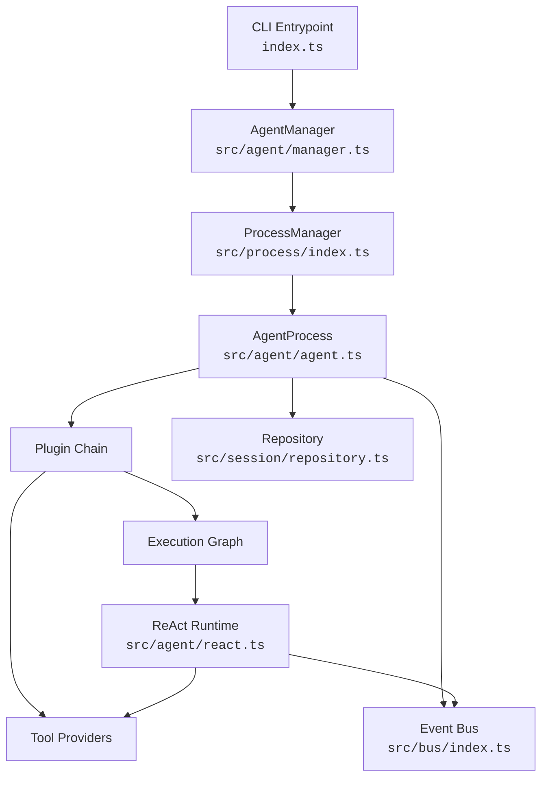

| Layer | Responsibility |
|---|---|
| **CLI** | Argument parsing, I/O rendering, request queuing |
| **AgentManager** | Session creation, plugin injection, sub-agent orchestration |
| **ProcessManager** | Async lifecycle tracking (idle → processing → completed/failed/cancelled) |
| **AgentProcess** | Plugin chain assembly, turn loop, conversation persistence |
| **Plugin Chain** | Composable hooks that modify state, tools, graphs, and commands |
| **Graph Runtime** | Directed-graph executor with conditional edges and subgraph nesting |
| **ReAct Runtime** | Model invocation, streaming, tool loop |
| **Event Bus** | Typed pub/sub for decoupled cross-cutting communication |
| **Repository** | SQLite-backed persistence for sessions, conversations, and messages |

---

## Process Lifecycle

Every agent runs inside a `ProcessManager`. The manager tracks each process through a deterministic state machine:

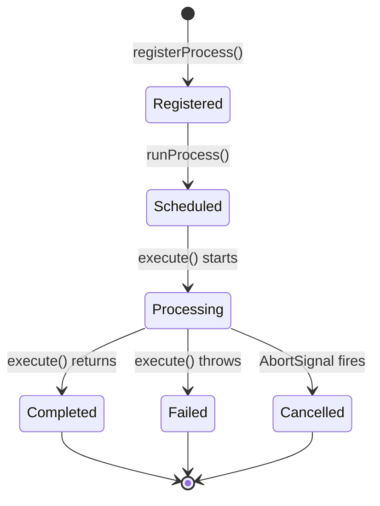

Key properties:

- **Registration** stores the process definition (name + execute function).
- **runProcess()** creates an instance with a unique ID, an `AbortController`, and an optional timeout.
- Execution happens in the background — `runProcess()` returns the instance ID immediately.
- Callers can poll status, await completion, or cancel via the returned ID.
- Lifecycle events are published on a `ProcessLifecycleEvent` topic for external observability.

`AgentManager` extends `ProcessManager` and wraps `AgentProcess` instances, adding session creation, MCP connection management, and sub-agent orchestration.

---

## AgentProcess and the Turn Loop

`AgentProcess` implements the `Process` interface. Its `execute()` method runs the core agent loop:

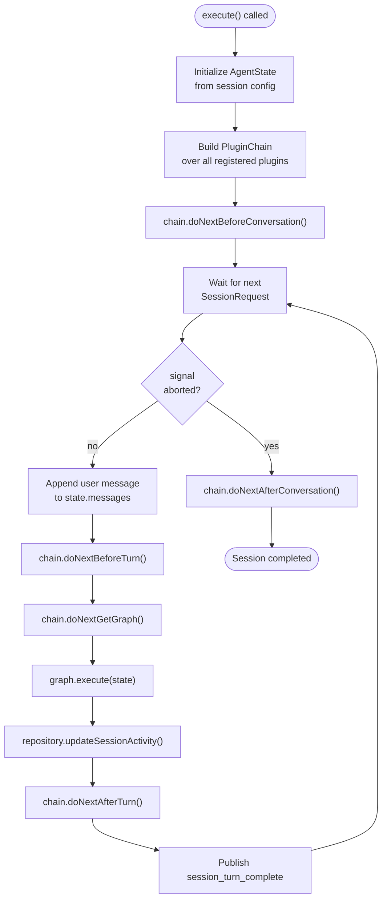

Each turn:

1. The process waits for an inbound `SessionRequest` (user message or sub-agent task).
2. Plugin hooks fire in order: `beforeTurn` → graph execution → `afterTurn`.
3. The graph is obtained from the plugin chain — typically the `ReActAgentPlugin` provides it.
4. Session lifecycle events (`session_turn_complete`, `session_error`) are published on the bus.
5. The loop continues until the request source signals EOF or the abort signal fires.

---

## Plugin System

Plugins are the primary extension mechanism. Every cross-cutting concern — tools, prompts, summarization, mode switching, Ralph loops — is implemented as an `AgentPlugin`.

### Plugin Interface

```typescript
interface AgentPlugin {
    name: string;
    description: string;
    beforeConversation?(state, chain): Promise<AgentState>;
    afterConversation?(state, chain): Promise<AgentState>;
    beforeTurn?(state, chain): Promise<AgentState>;
    afterTurn?(state, chain): Promise<AgentState>;
    getToolSet?(state, chain): Promise<ToolSet>;
    getGraph?(state, chain): Promise<Graph<AgentState>>;
    onCommand?(state, command, chain): Promise<void>;
}
```

### Plugin Chain

Plugins are composed into a `PluginChain` — a linked list where each plugin can:

- **Intercept** a hook, do work, then call `chain.doNext*()` to continue down the chain.
- **Short-circuit** by returning early without calling the chain.
- **Delegate** for tools and graphs: each plugin merges its own tools with the downstream set, and graph-wrapping plugins call `chain.doNextGetGraphAfter(state, this.name)` to obtain the inner graph before decorating it.

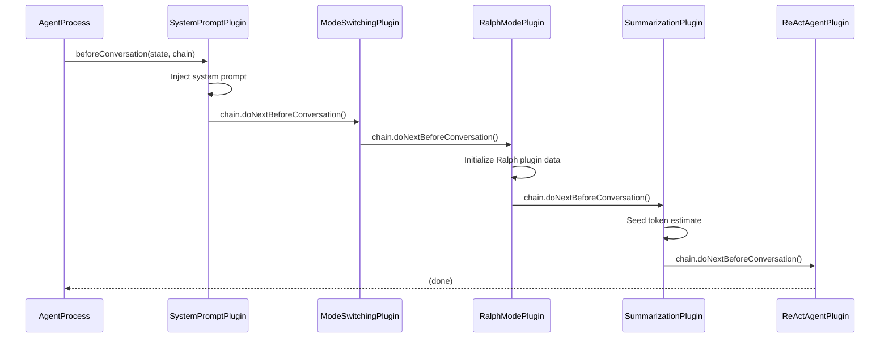

### Registered Plugins (default order)

| # | Plugin | Hooks Used | Purpose |
|---|--------|------------|---------|
| 1 | `SystemPromptPlugin` | `beforeConversation` | Renders and injects the system prompt |
| 2 | `ModeSwitchingPlugin` | `getToolSet` | Adds `SwitchToAgentMode` / `SwitchToPlanMode` tools |
| 3 | `RalphModePlugin` | `beforeConversation`, `getGraph`, `onCommand` | Wraps the inner graph in an outer iteration loop |
| 4 | `MCPToolsPlugin` | `getToolSet` | Merges tools from connected MCP servers |
| 5 | `BuiltInToolsProviderPlugin` | `getToolSet` | Provides filesystem and terminal tools (mode-gated) |
| 6 | `SkillsToolsPlugin` | `getToolSet` | Exposes skill activation tools |
| 7 | `SummarizationPlugin` *(conditional)* | `beforeConversation`, `beforeTurn`, `afterTurn`, `onCommand` | Tracks token usage, triggers conversation rotation |
| 8 | `ReActAgentPlugin` | `getGraph` | Builds and returns the ReAct execution graph |
| 9 | `SubAgentManagementPlugin` *(injected by manager)* | `getToolSet` | Adds `CreateSubAgent`, `GetSubAgentStatus`, `ListSubAgents` tools |

Plugins injected by `AgentManager` (like `SubAgentManagementPlugin`) are appended after the core set via `usePlugin()`.

---

## Graph Runtime

The `Graph<StateT>` class is a minimal directed-graph executor built on top of [graphology](https://graphology.github.io/). It provides the structural backbone for all agent execution flows.

### Core Concepts

- **Nodes** are async functions `(state: StateT) => Promise<StateT>` that transform state.
- **Edges** connect nodes. An edge can be **unconditional** (always follow) or **conditional** (a runtime choice function selects the next node from a mapping).
- **Subgraph nodes** embed an entire `Graph<StateT>` as a single node, enabling hierarchical composition.
- **START (`●`) / END (`⊙`)** are reserved sentinel nodes. A graph is valid if and only if a path exists from START to END.

### Execution Model

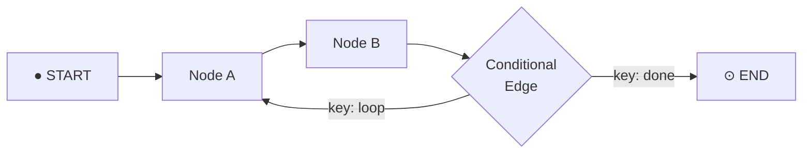

Execution walks from START, invoking each node's action, then consulting the node's `nextNodeChooser` to determine the next node. This continues until END is reached.

Graph plugins (`GraphPlugin<StateT>`) can observe execution with lifecycle hooks:

- `onGraphExecutionStart` / `onGraphExecutionEnd`
- `beforeNodeExecution` / `afterNodeExecution`
- `beforeEdgeTraversal` / `afterEdgeTraversal`

### ReAct Graph

The default execution graph is a simple single-node graph built by `makeReActGraph()`:

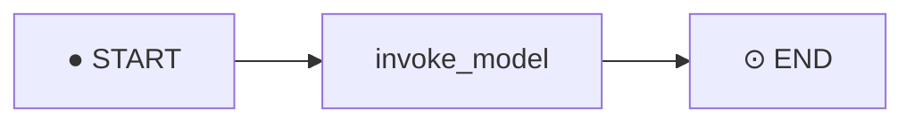

The `invoke_model` node:

1. Collects the merged `ToolSet` from the plugin chain.
2. Calls `streamText()` from the AI SDK with the current messages, tools, and model config.
3. Processes the full stream: emits reasoning/response/tool-call events on the bus.
4. Appends the model's response messages back into `state.messages`.
5. The AI SDK's `isLoopFinished()` stop condition handles the internal tool-call loop — the model keeps calling tools and getting results until it produces a final text response.

### Graph Wrapping (Ralph Mode Example)

Plugins that implement `getGraph` can wrap the downstream graph. `RalphModePlugin` demonstrates this pattern:

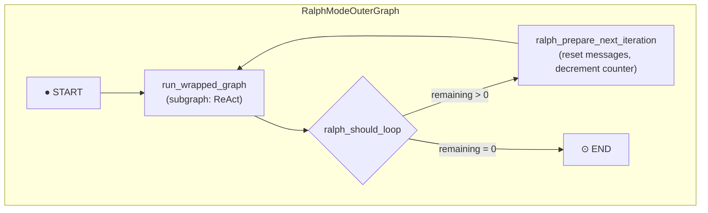

The wrapped graph (e.g. the ReAct graph) runs as a subgraph node. After each iteration, the outer graph checks whether more Ralph iterations remain. If so, it resets the conversation to just the system prompt and loops back.

---

## Event Bus

The `Bus` class provides a lightweight, in-memory, typed pub/sub system for decoupled communication between components.

### Design

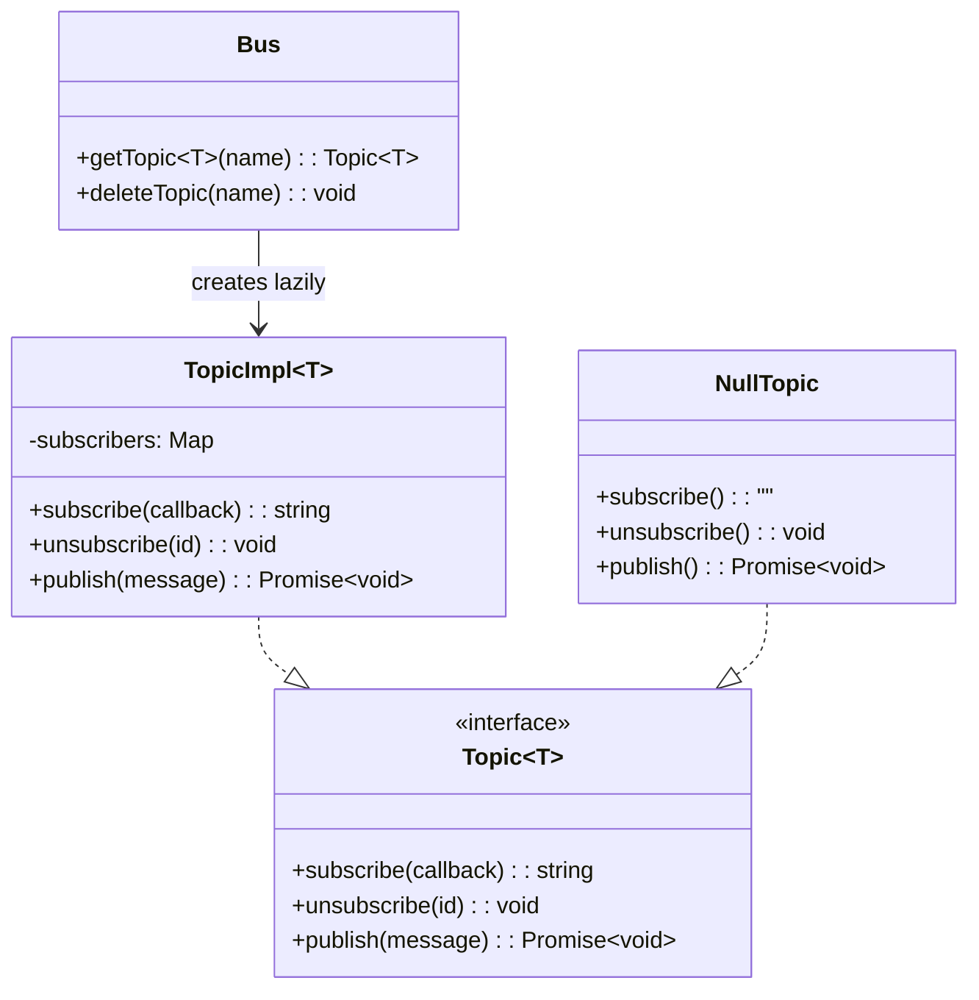

### Semantics

- Topics are created lazily on first `getTopic()` call and removed when their last subscriber unsubscribes.
- Delivery is **sequential** and **ordered**: subscribers are invoked one at a time, in subscription order.
- Subscriber failures are **isolated**: one failing subscriber does not block delivery to the rest.
- `NullTopic` is used as a safe default when a component wants to emit events but no pipeline is configured — subscriptions are ignored and messages are dropped silently.

### Event Families

| Topic | Event Type | Producer | Consumer |
|---|---|---|---|
| Session events | `AgentSessionEvent` | `AgentProcess` | CLI (turn rendering, error handling) |
| ReAct events | `ReActEvent` | `makeReActGraph` (stream processing) | CLI (reasoning/response rendering), `SummarizationPlugin` (token tracking) |
| Summarization events | `SummarizationEvent` | `SummarizationPlugin` | CLI / UI (lifecycle indicators) |
| Process lifecycle | `ProcessLifecycleEvent` | `ProcessManager` | External monitoring |
| Agent commands | `AgentCommand` | External caller (CLI, UI) | Plugins via `onCommand` hook |

### ReAct Event Flow

The `ReActEvent` discriminated union captures every phase of model interaction:

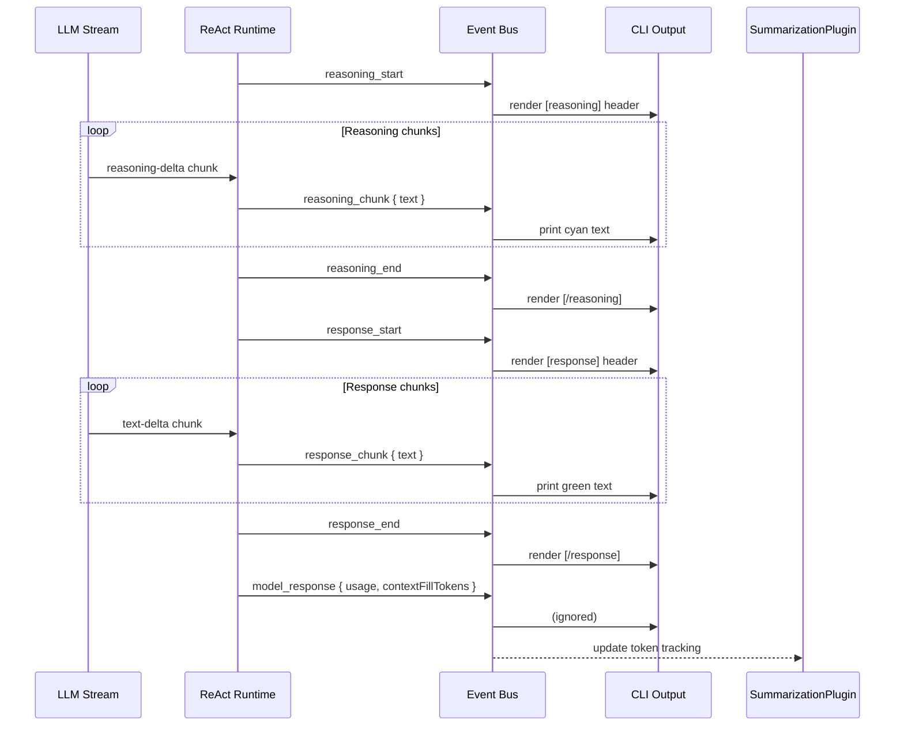

---

## Tool Composition

Tools reach the model through a chain of `getToolSet` calls across plugins. Each plugin calls `chain.doNextGetToolSet()` to collect tools from downstream plugins, then merges its own tools on top.

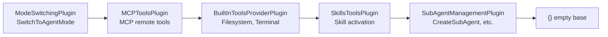

The final merged `ToolSet` is passed to `streamText()` inside the ReAct graph. Tool availability is **mode-gated**: filesystem write tools and terminal tools are only included when `state.mode === 'agent'`.

---

## Summarization

The `SummarizationPlugin` prevents context window overflow by monitoring token usage and rotating the conversation when pressure is high.

### Token Tracking Strategy

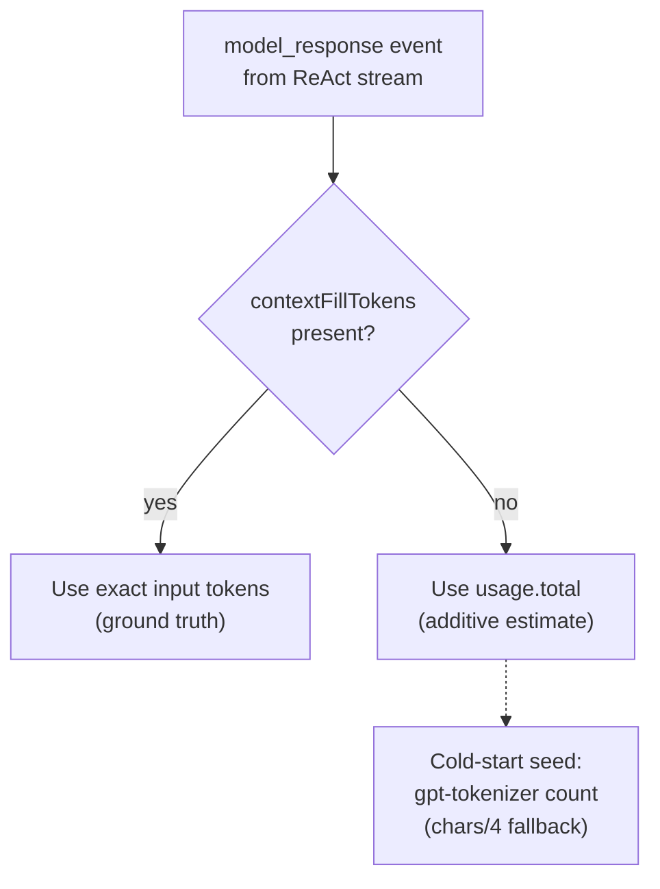

Three sources of token data, in priority order:

1. **Exact context fill** — `inputTokens` from `finish-step` chunks reported by the provider. This is the real context window occupancy including system prompt, tools, and all messages.
2. **Additive usage** — `usage.total` from the model response event, accumulated across turns.
3. **Heuristic seed** — `gpt-tokenizer` BPE encoding of serialized messages (falls back to chars÷4 if tokenization fails). Only used before the first real model response.

### Conversation Rotation

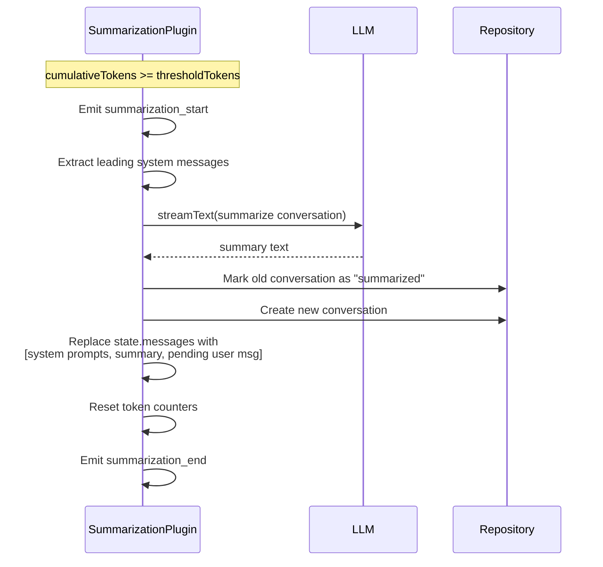

After rotation, the new conversation contains:

1. The original leading system messages (prompt, identity, instructions).
2. A continuation system message embedding the generated summary.
3. Any pending user message that triggered the rotation (preserved so the model can answer it).

---

## Session Persistence

The `Repository` class manages a SQLite database at `<workspace>/.overlord/repository.db`.

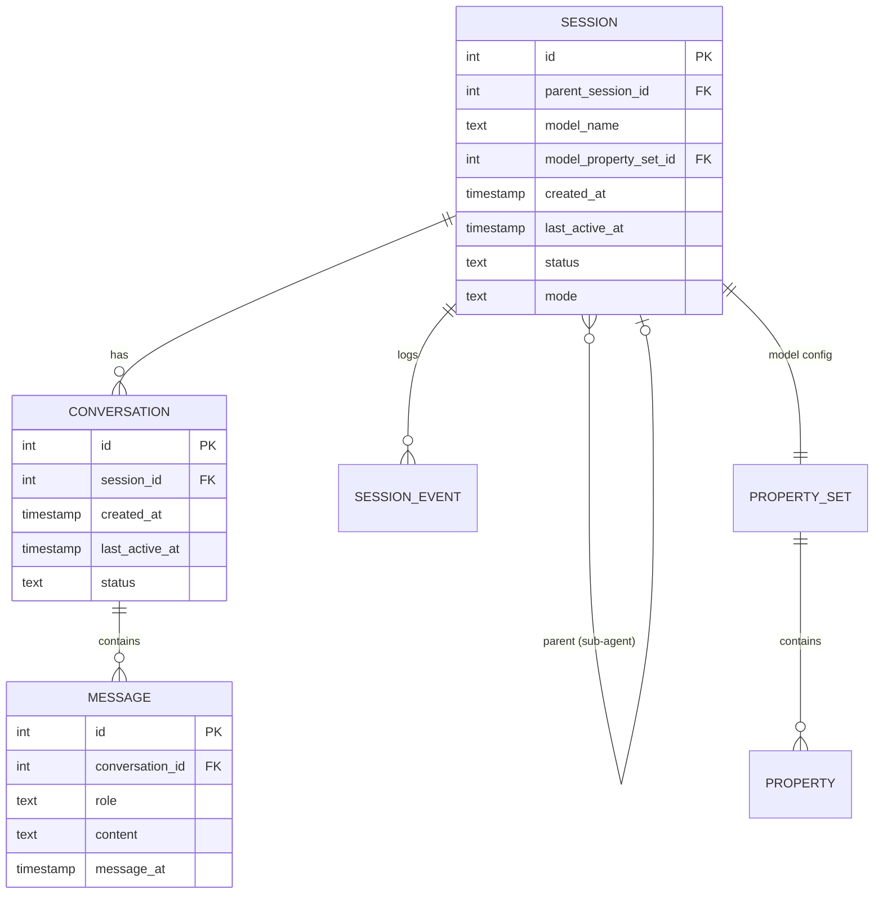

- A **session** represents one agent run (top-level or sub-agent).
- Each session has one or more **conversations**. When summarization rotates the conversation, the old one is marked `"summarized"` and a new `"active"` one is created.
- **Messages** are persisted per conversation for replay and debugging.
- Sub-agent sessions reference a `parent_session_id` for hierarchical tracking.

---

## Sub-Agent Orchestration

Top-level agents can spawn sub-agents through the `CreateSubAgent` tool (provided by `SubAgentManagementPlugin`). Sub-agents:

- Run as independent `AgentProcess` instances inside the same `ProcessManager`.
- Are linked to the parent via `parent_session_id` in the repository.
- Always start in `agent` mode (no planning phase).
- Receive a one-shot task message and terminate after the first turn.
- Cannot spawn their own sub-agents (recursion guard in the plugin).

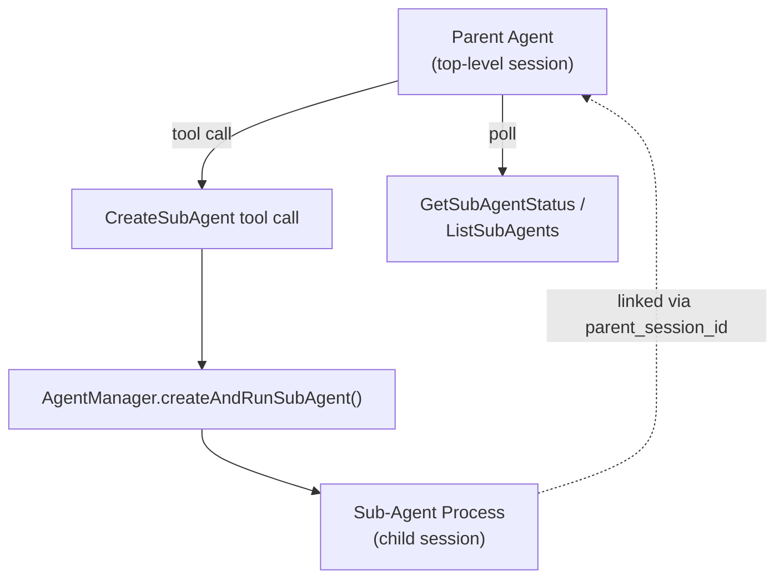

---

## MCP Integration

The `MCPClientManager` connects to external tool servers using the Model Context Protocol. Supported transports:

| Transport | Mechanism |
|---|---|
| `stdio` | Spawns a child process, communicates over stdin/stdout |
| `sse` | Server-Sent Events over HTTP |
| `http` / `streamableHttp` | Streamable HTTP transport |

On connection, each server's tool metadata is fetched via `listTools()`. The tools are converted into AI SDK `ToolSet` entries with Zod schemas derived from the JSON Schema definitions. When the model calls an MCP tool, `MCPClientManager.callTool()` forwards the invocation to the appropriate server.

---

## Prompt System

The `PromptTemplate` class assembles the system prompt from composable sections:

| Section | Source | Notes |
|---|---|---|
| System informations | `~/.overlord/SYSTEM.md` | Handlebars-interpolated (date, OS, etc.) |
| About you | `~/.overlord/SOUL.md` or workspace `.overlord/SOUL.md` | Agent identity/personality |
| About the user | `~/.overlord/USER.md` or workspace `.overlord/USER.md` | User preferences |
| General Instructions | `AGENTS.md` or `.claude/CLAUDE.md` in workspace | Project-specific instructions |
| Available Skills | Dynamic from `SkillsLoader` | Markdown table of all loaded skills |
| Active Skill | Dynamic from `SkillsLoader` | Full content of the currently active skill |
| Current Mode | Dynamic | Describes plan vs. agent mode |
| Current Plan | Dynamic from `PlanTools` | Markdown table of pending tasks |

Workspace-level files override home-directory defaults. The prompt is rendered once at conversation start and injected as the first system message.

---

## Skill System

Skills are `SKILL.md` files with YAML front matter discovered from multiple directories:

- `~/.agents/skills`
- `~/.config/overlord/skills`
- `.agents/skills` (workspace)
- `.overlord/skills` (workspace)

Each skill exposes a tool (`Skill`) that the agent can call to activate it by `skill_id`. Activation loads the full skill content into the prompt context. Skills are validated at load time (name format, length limits, required fields).

---

## Agent Commands

Running agents accept inbound commands through an optional `commandTopic`. Commands are delivered to all plugins via the `onCommand` hook — the agent process itself does not interpret them.

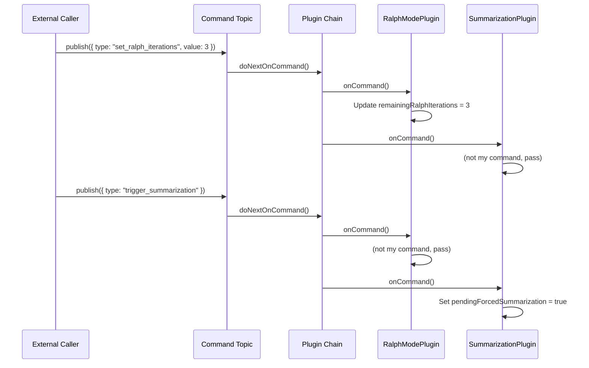

| Command | Handler | Effect |
|---|---|---|
| `set_ralph_iterations` | `RalphModePlugin` | Sets `remainingRalphIterations`, takes effect at the next loop decision |
| `trigger_summarization` | `SummarizationPlugin` | Forces summarization before the next turn |
