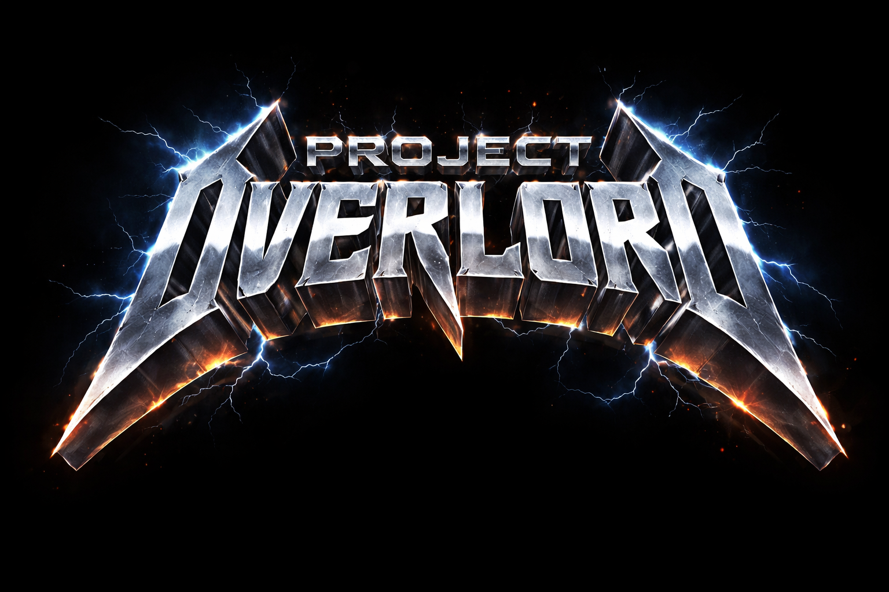
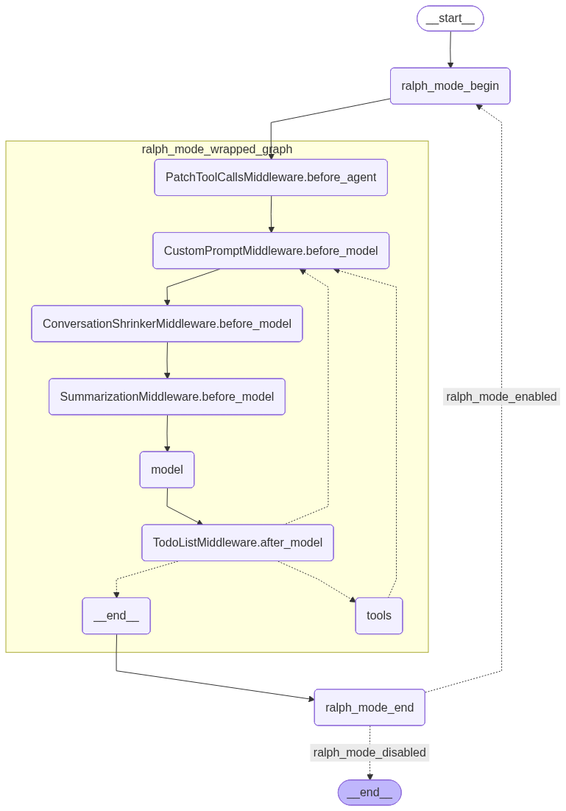
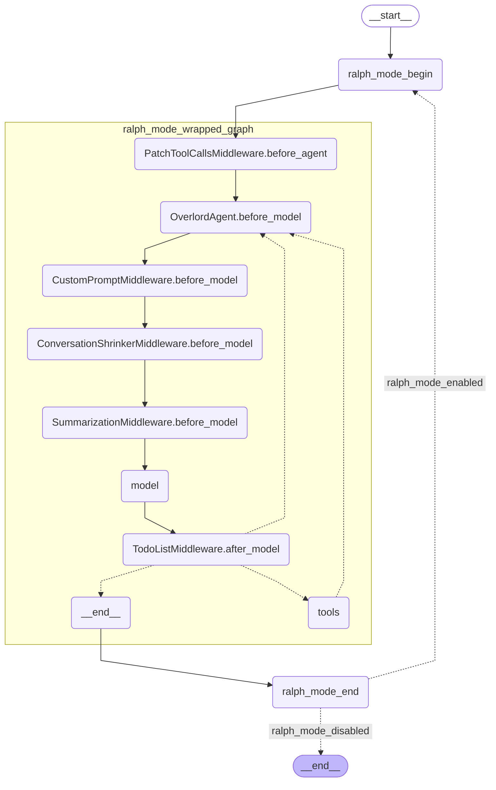

[](https://docs.astral.sh/ruff/)
[](https://github.com/jrialland/overlord/blob/main/LICENSE)
[](https://github.com/jrialland/overlord)
[](https://github.com/jrialland/overlord)
<!--[](https://github.com/jrialland/overlord/actions) -->
<!--[](https://coveralls.io/github/jrialland/overlord?branch=develop) -->
<!--[](https://github.com/PyCQA/bandit) -->
<!--[](https://badge.fury.io/py/overlord) -->
<!--[](https://pypi.org/project/overlord/) -->

A crude coding agent running in non-interactive CLI mode.


This is an experiment in using different techniques to get complex coding tasks done without supervision over long periods.


> ⚠️ Very experimental, Work In Progress: This was *not* designed with privacy or safety in mind! – I'm not your mother, but be careful anyway.

# What it is

- A good way to burn tokens
- A mix of various ideas on implementing agents
- A simple command-line that lets you start a coding task on a workspace directory you specify. Configuration files may be copied from a "template" folder, or an archive.

# What it is not

- A production-ready fancy openclaw clone
- A general-purpose personal assistant
- Something I would use for real stuff (yet)

# Technical insights

- A custom [skill system](https://agentskills.io/) (simple, but rather aligned with official specs) is implemented [here](./src/overlord/prompt/skills.py)
- A handful of home-made [skills](./workspace-template/.overlord/skills/)
- Trying to [RAG](https://en.wikipedia.org/wiki/Retrieval-augmented_generation) technical docs: in a workspace, if there is a folder named "documentation", its content is indexed and used as a basis for plain RAG in the system prompt (no "rag-as-tool")
- Support for MCP tools (see [sample configuration](./workspace-template/config.yaml))
- Use of [@modelcontextprotocol filesystem tools](https://github.com/modelcontextprotocol/servers/tree/main/src/filesystem#readme) instead of the ones provided by deepagents. There is an open issue regarding this.
- [jcodemunch](https://github.com/jgravelle/jcodemunch-mcp) for much faster source code browsing
- [Ralphing](https://ghuntley.com/ralph/) like there's no tomorrow

# Opened issues

- Find how to get completely rid of some deepagents default tools; some tools overlap with MCP ones, LLM is confused
- Not really eager to activate skills; may be solved by having a plain planning phase and asking for a skill to activate in a question with structured output

# WISHES

- Start with a structured output question in order to force skill activation
- Persist context
- Handle multiple 'phases' (plan, implement, review loop); in the style of [GOAL.md](https://github.com/jmilinovich/goal-md)
- Investigate sub-agent features
- Let agents run in a daemon process (gateway style)
- Fancy UI

## The system prompt

The system prompt is quite (maybe too?) large and sophisticated

The following files are read when they exist. placeholders are interpolated using [jinja2](https://jinja.palletsprojects.com/en/stable/)
They are mainly here to give some 'personnality' to the agent, (very) roughly in the spirit of what openclow does.

### ["IDENTITY.md"](/workspace-template/.overlord/IDENTITY.md)

Agent's identity: its name, what it is running on, etc.

### ["SOUL.md"](./workspace-template/.overlord/SOUL.md)

Core values and principles guiding the agent's behaviour.

### ["AGENTS.md"](./workspace-template/AGENTS.md)

General agent rules. (see https://agents.md/ )

General rules for agents that you would put in the root folder of your project.
As this file is not loaded from the '.overlord' directory, but rather directly from workspace's root.

### ["USER.md"](./workspace-template/.overlord/USER.md)

Information about the user, identity and preferences.

### Description of available skills

This section describes the skills found in various well-known directories, and is generated on the fly.

### search result on project documentation using RAG.

If there is a "documentation" folder in the workspace, files are indexed and the best matching chunks are shown in a summary.
The search is based on the user's query.

### memory section

Read the last n lines from `<agent>/MEMORY.md`. The agent can use a specific tool as a journal in order to track relevant info in its journal.

## How RAG works

this feature will use the 'embedding_model' that is defined in configuration.
[Qdrant](https://qdrant.tech/) is the vector database, it saves the index in '.qdrant_data/' below the indexed folder

## Agent graph (will evolve)
<!--  -->



## Choosing a LLM

In practice I've been using:

- ['glm-5:cloud'](https://ollama.com/library/glm-5) through Ollama, provides excellent results; this is the default configuration

- [Kimi k2.5](https://platform.moonshot.ai/), either directly from Moonshot (in this case, you would have to use the provided [specific implementation](./src/overlord/models/moonshot.py) of ChatModel in order to have thinking capabilities to work) – or through Ollama (['kimi-k2.5:cloud'](https://ollama.com/library/kimi-k2.5)).

- Some local Ollama models (mainly [qwen3.5:35b](https://ollama.com/library/qwen3.5:35b))

AFAIK the [configuration system](./workspace-template/.overlord/config.yaml) can manage several providers, but these are untested.

## How to install

You'll need:

* [python](https://www.python.org/) >= 3.13
* [uv](https://docs.astral.sh/uv/)
* [casey/just](https://github.com/casey/just) for running tests and demos easily
* [node.js](https://nodejs.org/fr) is used by several default MCP servers. `npx` has to be in your PATH
* Any access to a decent LLM with thinking capabilities

## Installing just (if you do not have it yet)

[just](https://just.systems/) is a very practical and efficient tool !

```shell
uv tool install rust-just
```

## Running the demo


The default configuration uses Ollama. Make sure to `ollama pull "glm-5:cloud"` before running.


The demo will (most of the time) scaffold a sample Flask webapp in DEMO_WORKSPACE


```shell
just demo
```

## Running overlord

```shell
> uv run overlord-cli --help
Usage: overlord-cli [OPTIONS]

  CLI command to run an Overlord agent.

Options:
  -w, --workspace TEXT           Path to the workspace directory.  [required]
  -t, --workspace-template TEXT  Optional path to a workspace template to
                                 initialize from.
  -c, --config TEXT              Optional path to a configuration file
                                 (defaults to workspace/.overlord/config.yaml
                                 if not provided).
  -n, --nickname TEXT            Nickname for the agent. If not provided, a
                                 new agent will be created with a random
                                 nickname.
  -q, --query TEXT               Initial query or task for the agent to
                                 execute upon startup. Reads from input() if
                                 missing.
  --debug                        Enable debug mode.
  --help                         Show this message and exit.
```
