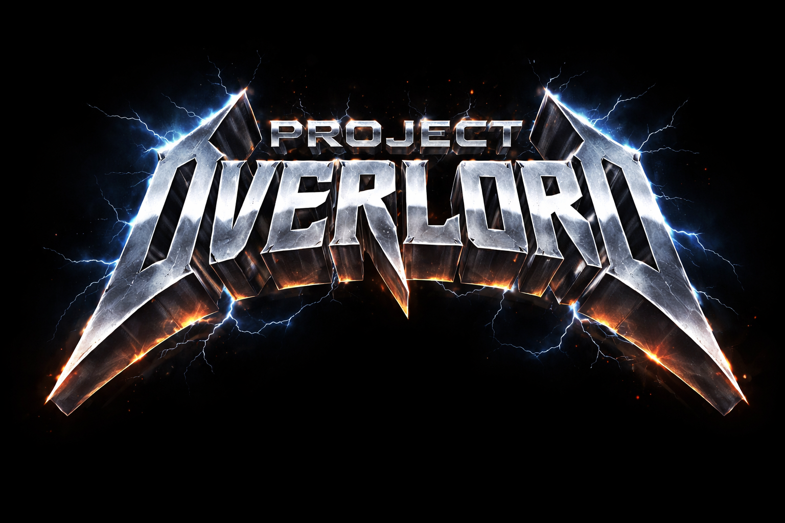

# Overlord



Overlord is an AI coding agent CLI built with Bun and TypeScript. It runs a ReAct-style agent directly against your local workspace, with real tools for file editing, terminal execution, skills, sub-agents, and MCP integration.

If you want a local-first agent runtime you can run, inspect, and extend, Overlord is built for that.

> The very first version was written in python using the langchain deepagents library - This has now been completely rewritten in typescript using the Vercel AI sdk.

**Let it introduce itself** :

```bash
bun run index.ts --model ollama/glm-5:cloud --query "Make a summary about the current project : technical stack, market positioning, strengths, weaknesses. Conclude by explaining why it is demonstrative of recent agentic techniques, and list usecases for which this project could be useful"
```

---
## Overlord Project Summary

### Technical Stack

**Core Technologies:**
- **Runtime:** [Bun](https://bun.sh/) (modern JavaScript/TypeScript runtime)
- **Language:** [TypeScript](https://www.typescriptlang.org/) 5.x
- **AI SDK:** [Vercel AI SDK](https://ai-sdk.dev/) v7.x (beta)
- **Architecture Pattern:** Plugin-based with graph orchestration

**Key Dependencies:**
- **[graphology](https://github.com/graphology/graphology)** - Graph-based execution engine
- **[@modelcontextprotocol/sdk](https://github.com/modelcontextprotocol/typescript-sdk)** - MCP protocol implementation
- **[gpt-tokenizer](https://github.com/niieani/gpt-tokenizer)** - Token counting for context management
- **[zod](https://zod.dev/)** - Schema validation
- **[handlebars](https://handlebarsjs.com/)** - Template engine for prompts
- **[pino](https://getpino.io/#/)** - High-performance logging
- **[SQLite](https://sqlite.org/index.html)** - Session persistence (embedded database)

**Model Providers Supported:**

- [Ollama](https://ollama.com/) (local models and cloud models)
- [OpenAI](https://developers.openai.com/api/docs/guides/completions)
- Any [OpenAI-compatible] model, through vercel [gateway](https://vercel.com/ai-gateway)

**Transport Protocols:**

- stdio, SSE, streamable_http (for MCP)

---

### Market Positioning

Overlord positions itself as a **local-first AI coding agent framework** that bridges the gap between:

1. **End-user tools** (like Cursor, Aider, Continue) - which are polished but limited in customization
2. **Agent frameworks** (like LangChain, AutoGPT) - which are powerful but require extensive setup
3. **Raw model APIs** - which provide flexibility but lack tool integration

**Target Audience:**

- Developers who want control over their AI workflow
- Teams needing on-premises AI agents (privacy/security)
- Researchers experimenting with agent architectures
- Power users wanting to extend/modify agent behavior

**Differentiation:**

- Transparent, inspectable architecture
- Plugin system allows deep customization
- No vendor lock-in (works with any OpenAI-compatible model)
- Local-first design (works offline with Ollama)
- Demonstrates cutting-edge agentic patterns in production code

---

### Strengths

#### 1. **Architecture & Design** ★★★★★

- **Clean plugin system** - Every feature (summarization, mode switching, Ralph loops, MCP tools) is a plugin
- **Graph-based execution** - Sophisticated directed-graph runtime for complex agent flows
- **Event-driven architecture** - Decoupled components via typed pub/sub bus
- **Mode separation** - Plan mode vs. Agent mode for safer tool access

#### 2. **Extensibility** ★★★★★

- **Skills system** - Load specialized capabilities from markdown files
- **MCP integration** - Connect to any Model Context Protocol server
- **Sub-agent orchestration** - Delegate tasks to child agents
- **Plugin hooks** - Intercept at every stage (conversation, turn, tools, graph)

#### 3. **Context Management** ★★★★★

- **Automatic summarization** - Monitors token usage, rotates conversations when pressure is high
- **Multiple token estimation strategies** - Exact, additive, and heuristic fallback
- **Conversation persistence** - SQLite-backed replay capability

#### 4. **Advanced Agentic Features** ★★★★★


- **Ralph Mode** - Iterative fresh-conversation loops (Wiggum technique)
- **ReAct runtime** - Reasoning-Action cycle with streaming
- **Sub-agents** - Parallel task delegation
- **Structured output** - Schema-driven responses

#### 5. **Developer Experience** ★★★★☆

- Well-documented README with demo scenarios
- Integration tests for real runtime behavior
- Clear separation of concerns in codebase
- CLI-first design (easy to script and automate)

### Weaknesses

#### 1. **Documentation Gaps** ★★★☆☆

- Architecture documentation exists but could be more beginner-friendly
- Missing tutorials for plugin development
- No deployment/operations guide for teams

#### 2. **Production Readiness** ★★★☆☆

- Dependencies include beta packages (AI SDK v7.0.0-beta.x)
- No versioning strategy published
- Limited error handling documentation
- No observability integrations (metrics, tracing)

#### 3. **User Experience** ★★★★☆

- CLI-only interface (no GUI)
- Requires technical knowledge to configure
- No collaborative features (multi-user sessions)

#### 4. **Testing & Quality** ★★★☆☆

- Good unit test coverage
- Integration tests exist but limited in scope
- No end-to-end testing framework
- Missing performance benchmarks

#### 5. **Safety & Guardrails** ★★★★☆

- Mode separation prevents unsafe tool access
- No explicit content filtering
- No rate limiting or cost controls
- Limited sandboxing for terminal commands

### Why This Demonstrates Recent Agentic Techniques

Overlord implements several **state-of-the-art agentic patterns** that have emerged recently:

#### 1. **ReAct (Reasoning + Acting) Pattern**

The core runtime follows the ReAct paradigm where the model explicitly reasons before taking actions, making the decision process transparent and debuggable.

#### 2. **Hierarchical Agent Orchestration**

Support for **sub-agents** demonstrates the multi-agent pattern where a parent agent delegates specialized tasks to child agents - a technique used in systems like AutoGen and CrewAI.

#### 3. **Context Window Management via Summarization**

Implements the **conversation rotation pattern** with automatic summarization when context pressure exceeds thresholds - critical for long-running agent sessions.

#### 4. **Graph-Based Workflow Orchestration**

Uses **graphology** to implement directed-graph execution, enabling complex agent workflows with conditional edges, loops, and subgraphs. This is similar to LangGraph and other graph-based agent frameworks.

#### 5. **Ralph Wiggum Technique**

Implements an experimental **iterative reset pattern** where the agent runs in loops with fresh contexts, allowing it to tackle problems from multiple angles without accumulating errors.

#### 6. **Model Context Protocol (MCP)**

Early adopter of **Anthropic's MCP standard** for tool integration, demonstrating interoperability with external tool servers across different transports.

#### 7. **Skill-Based Specialization**

The **skills system** allows agents to acquire specialized capabilities on-demand, similar to tool-calling but with richer context and instruction injection.

#### 8. **Streaming-First Design**

All model interactions stream reasoning and response tokens in real-time, providing immediate feedback and enabling responsive UIs.

#### 9. **Mode-Based Safety**

Implements **plan mode** vs. **agent mode** separation, where destructive tools (file writes, terminal) are only available in agent mode after explicit approval - a pattern gaining traction for safer agents.

#### 10. **Plugin Architecture**

The **composable plugin chain** demonstrates modern dependency injection and middleware patterns adapted for AI agents, allowing feature composition without tight coupling.


### Use Cases

#### 1. **Local AI Coding Assistant**

Developers can run Overlord locally with Ollama to get help with:
- Code generation and refactoring
- Debugging and error analysis
- Documentation writing
- Test creation

#### 2. **Codebase Exploration**

- Generate architecture overviews
- Map dependencies and relationships
- Identify code smells and technical debt
- Create migration plans

#### 3. **Automated Code Review**

- Analyze pull requests for issues
- Suggest improvements
- Check for security vulnerabilities
- Verify coding standards compliance

#### 4. **Research & Experimentation**

- Test new prompting strategies
- Compare model behaviors
- Prototype agent architectures
- Benchmark different providers

#### 5. **CI/CD Integration**

- Automated code analysis in pipelines
- Generate release notes
- Validate configuration files
- Run safety checks

#### 6. **Documentation Generation**

- Create README files
- Generate API documentation
- Write inline code comments
- Produce architectural decision records

#### 7. **Team Knowledge Management**

- Create and share skills for team workflows
- Standardize development practices
- Onboard new developers with guided exploration
- Build organization-specific tool integrations via MCP

#### 8. **Complex Task Orchestration**

Use sub-agents to parallelize:
- Multi-file refactoring
- Cross-service analysis
- Large-scale migrations
- Data processing pipelines

#### 9. **Safe Code Execution Sandbox**

- Run with read-only filesystem tools
- Test scripts in isolation
- Validate outputs before applying changes
- Experiment with unfamiliar codebases

#### 10. **Education & Learning**

- Understand how AI agents work internally
- Learn about prompt engineering
- Study agent architecture patterns
- Develop intuition for model behavior


### Conclusion

**Overlord is a sophisticated, well-architected AI coding agent that demonstrates cutting-edge agentic techniques while remaining practical for daily use.** It successfully balances being both a usable tool and a reference implementation for modern agent design patterns.

The project excels in its **plugin architecture**, **graph-based orchestration**, and **context management**, making it an excellent showcase of how to build production-quality AI agents with current state-of-the-art techniques. While it has some gaps in production readiness and user onboarding, its strengths in extensibility and architectural clarity make it valuable for both end-users and developers looking to understand or build upon modern agent frameworks.

Its local-first, vendor-agnostic approach positions it well for organizations with privacy requirements or those wanting to avoid cloud dependencies, while its MCP support ensures it can integrate with the growing ecosystem of AI tools and services.

---

## Highlights

- Workspace-aware AI agent with one-shot and interactive modes
- ReAct runtime with streaming reasoning and response chunks
- Built-in filesystem and terminal tools
- Skill system powered by `SKILL.md` files with metadata (from [agentskills.io](https://agentskills.io/) specs )
- Sub-agent orchestration for delegated tasks
- Conversation summarization with automatic context-window rollover
- Ralph mode plugin for iterative fresh-conversation loops
- MCP support (`stdio`, `sse`, `http`, `streamableHttp`)
- Structured output support via schema-driven responses

## Why Overlord

Overlord combines practical day-to-day agent behavior with a reusable runtime architecture.

- Use it as a CLI coding assistant right away
- Extend it as a framework with plugins, graphs, and tools
- Keep control over model/provider choice (Ollama locally, or gateway-backed models)

## How To Run

### 1) Install

```bash
bun install
```

### 2) Show CLI Help

```bash
bun run index.ts --help
```

### 3) Run A Quick One-Shot Query

```bash
bun run index.ts --model ollama/kimi-k2.5:cloud --query "Summarize this repository"
```

### 4) Start Interactive Mode

```bash
bun run index.ts --model ollama/kimi-k2.5:cloud --interactive
```

### 5) Run Against Another Workspace

```bash
bun run index.ts --workspace ../some-project --model ollama/kimi-k2.5:cloud --query "Map this codebase"
```

### 6) Try Reasoning Levels

```bash
bun run index.ts --model openai/o3 --reasoning high --query "Plan a refactor strategy"
```

### 7) Enable Automatic Summarization

```bash
bun run index.ts --model ollama/kimi-k2.5:cloud --summarize --summary-threshold 80 --query "Summarize this repository"
```

Accepted values for `--reasoning`:

- `none`
- `low`
- `medium`
- `high`
- `xhigh`

## Demo Scenarios

Use these prompts to quickly demonstrate core features.

### Skill Activation Demo

```bash
bun run index.ts --model ollama/kimi-k2.5:cloud --query "Use the Skill tool with skill_id ai-sdk, then tell me the first line of that skill content."
```

### Sub-Agent Demo

```bash
bun run index.ts --model ollama/kimi-k2.5:cloud --query "Create a sub-agent to inspect loaded skills and report back what it can use."
```

### Summarization Integration Demo

```bash
bun test integration/summarization.integration.test.ts
```

This integration test exercises a real end-to-end summarization flow: agent run, summarization trigger, conversation rotation, and event emission.

## Configuration

Create `~/.config/overlord/overlord.json` (JSON5) to define defaults and MCP servers.

```json5
{
  defaultModel: 'ollama/kimi-k2.5:cloud',
  defaultModelConfig: {
    // provider/model options
  },

  summarization: {
    enabled: true,
    thresholdPercentage: 85,
    minimumResponseReserveTokens: 4096,
    // optional override when model metadata is unavailable
    contextWindowSize: 131072,
  },

  mcp: {
    local_tools: {
      transport: 'stdio',
      command: 'node',
      args: ['path/to/server.js'],
    },

    remote_tools: {
      transport: 'streamableHttp',
      url: 'https://example.com/mcp',
      headers: {
        Authorization: 'Bearer YOUR_TOKEN',
      },
    },
  },
}
```

Supported MCP transport values:

- `stdio`
- `sse`
- `http`
- `streamableHttp`

## Feature Overview

### ReAct Runtime

- Streams reasoning and final response tokens
- Preserves full assistant/tool message traces in state
- Supports schema-based structured output

### Built-In Tools

Filesystem tools and terminal tools are available to the agent and can be extended with MCP-provided tools.

### Skills

Skills are loaded from `SKILL.md` files (with YAML front matter) and can be activated by name through the `Skill` tool.

Scanned directories include:

- `~/.agents/skills`
- `~/.config/overlord/skills`
- `okenizer-backed cold-start token estimation with heuristic fallback
- trigger counter in plugin state
- lifecycle events (`summarization_start`, `summarization_end`) for UI integration
- preserves initial system prompts and pending user message when rotating
- responds to the `trigger_summarization` command to force an immediate summarization on the next turn
- CLI flags: `--summarize`, `--summary-threshold`, `--summary-reserve-tokens`, `--summary-context-window`

The summarization plugin helps keep long sessions safe by rotating conversations when context pressure becomes high.

- pre-turn and post-turn checks
- trigger counter in plugin state
- lifecycle events (`summarization_start`, `summarization_end`) for UI integration
- preserves initial system prompts and pending user message when rotating
- responds to the `trigger_summarization` command to force an immediate summarization on the next turn

### Ralph Mode

Ralph mode is implemented as an `AgentPlugin` that wraps execution in a looping graph.

Behavior:

- Stores `iterations` and `remainingRalphIterations` in `state.pluginData`
- At the end of each turn, checks whether `remainingRalphIterations > 0`
- If iterations remain, decrements counters and jumps back to the graph start
- Each new loop iteration runs with a fresh conversation context (only the initial system prompt is kept)
- Responds to the `set_ralph_iterations` command to adjust the remaining count on a running agent

The term "Ralph" comes from **The Ralph Wiggum technique**, an article by Geoff Huntley.

### Agent Commands

A running agent can receive inbound commands through an optional `commandTopic` injected at startup. Commands are defined in `AgentCommand` and handled by plugins via the `onCommand` hook — the agent process itself does not interpret command payloads.

Current commands:

| Command | Handler | Effect |
|---|---|---|
| `set_ralph_iterations` | `RalphModePlugin` | Sets `remainingRalphIterations` to the given value, taking effect at the next loop decision point |
| `trigger_summarization` | `SummarizationPlugin` | Forces summarization before the next turn, bypassing the token threshold |

## Project Structure

```text
.
├─ index.ts                  CLI entrypoint
├─ src/
│  ├─ agent/                 core runtime, plugins, graph orchestration
│  ├─ mcp/                   MCP transport and tool bridge
│  ├─ skills/                skill loading and tool exposure
│  ├─ tools/                 filesystem and terminal tools
│  └─ session/               persistence and conversation repository
├─ integration/              integration scenarios (real runtime behavior)
└─ testscripts/              probes and experiments
```

## Development

```bash
bun test
```

```bash
bun run lint
```

